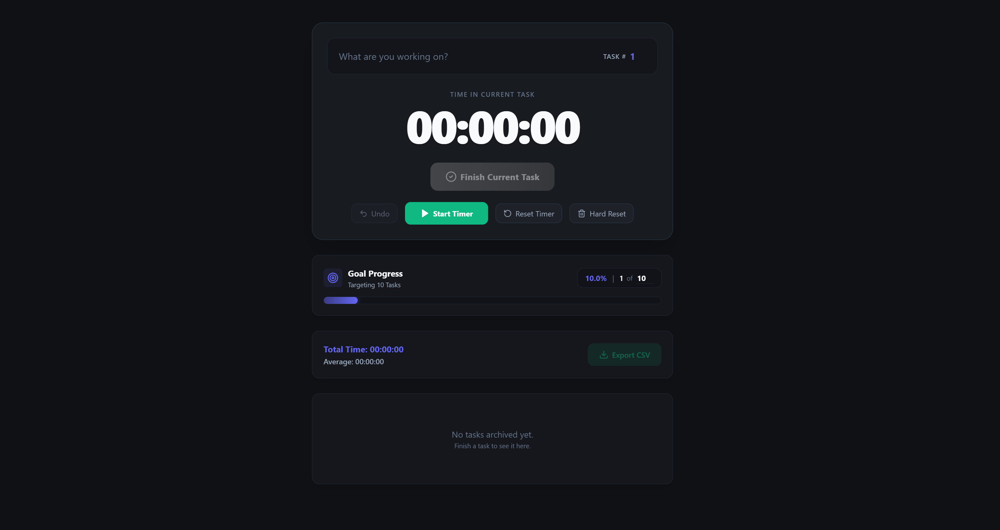

# ⏱️ TaskTracker

A high-performance, minimalist task tracking application built for speed and clarity. 

[](https://reactjs.org/)
[](https://vitejs.dev/)
[](https://tailwindcss.com/)
[](https://www.typescriptlang.org/)
[](https://zustand-demo.pmnd.rs/)

---

### 🚀 [Live Demo](https://javchz.github.io/tasktracker/)

TaskTracker helps you manage your daily productivity with a focus on time awareness. Set your goals, track your tasks, and stay on top of your progress with a sleek, modern interface.

## ✨ Features

- **⏱️ Task Timer**: Real-time tracking of time spent on individual tasks.
- **🎯 Goal Management**: Set a daily or project-based task goal and visualize your progress.
- **📊 Live Statistics**: Monitor total time spent and average task duration at a glance.
- **📂 Task Archive**: A concise history of your completed tasks.
- **📥 CSV Export**: Export your task history for further analysis or reporting.
- **🎨 Glassmorphic UI**: A premium dark-mode aesthetic with smooth animations and responsive design.

## 🛠️ Technology Stack

- **Core**: React 18 with TypeScript
- **Build Tool**: Vite 6
- **State Management**: Zustand (replacing legacy Context API for better performance)
- **Styling**: Tailwind CSS v4 (using the latest features)
- **Icons**: Lucide React
- **Deployment**: GitHub Pages

## 💻 Getting Started

### Prerequisites

- [Node.js](https://nodejs.org/) (v24 or higher recommended)
- [npm](https://www.npmjs.com/)

### Installation

1. Clone the repository:
   ```bash
   git clone https://github.com/javchz/tasktracker.git
   ```
2. Navigate to the project directory:
   ```bash
   cd tasktracker
   ```
3. Install dependencies:
   ```bash
   npm install
   ```

### Development

Start the development server:
```bash
npm run dev
```

### Building for Production

Build the project:
```bash
npm run build
```
The output will be in the `dist/` directory.

## 📦 Deployment

This project is configured for automated deployment to GitHub Pages.

To deploy manually:
```bash
npm run deploy
```

## 📄 License

This project is licensed under the [MIT License](LICENSE).

### Third-Party Software
TaskTracker is powered by excellent open-source software:
- **[React](https://reactjs.org/)** (MIT)
- **[Vite](https://vitejs.dev/)** (MIT)
- **[Tailwind CSS](https://tailwindcss.com/)** (MIT)
- **[Zustand](https://zustand-demo.pmnd.rs/)** (MIT)
- **[Lucide React](https://lucide.dev/)** (ISC)
- **[TypeScript](https://www.typescriptlang.org/)** (Apache 2.0)

---

*Made with ❤️ by [javchz](https://github.com/javchz)*
